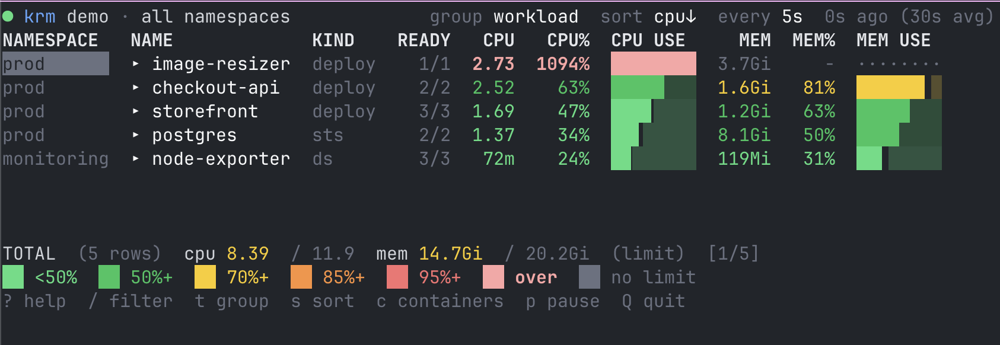
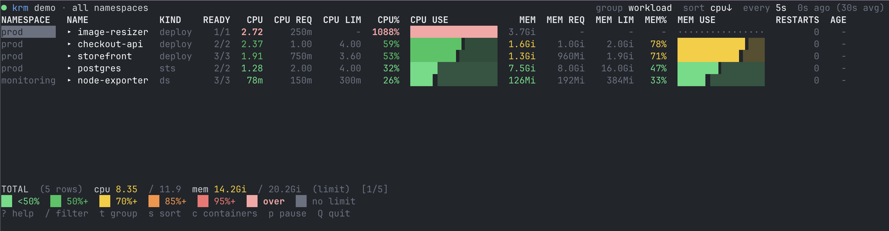

<p align="center">
  
</p>
  
# kube-resource-monitor (`krm`)

> **⚠️ Notice:**
> _This is very preliminary and is subject to change, possibly drastically._

A terminal UI for monitoring Kubernetes workload resource usage with snapshot
or watching indefinitely. Workload resource usage is contextualized with the
resource request and limit settings.

<p align="center">
  
</p>

```
● krm  kind-dev · prod                    group workload  sort cpu↓  every 5s  3s ago (30s avg)
NAME                KIND    READY   CPU  CPU LIM  CPU%  CPU USE          MEM  MEM LIM  MEM%  MEM USE
▸ checkout-api      deploy    2/2  2.19     4.00   55%  ██████▌░░░░░   1.5Gi    2.0Gi   74%  ████████▉░░░
▸ storefront        deploy    3/3  2.11     3.60   59%  ███████░░░░░   1.4Gi    1.9Gi   77%  █████████▏░░
  └ storefront-…-p8w3d pod    2/2  1.11     1.20   92%  ███████████░   654Mi    640Mi  102%  ████████████
▸ postgres          sts       2/2  1.34     4.00   34%  ████░░░░░░░░   7.9Gi   16.0Gi   50%  █████▉░░░░░░
```

## What it does

- **Rolls usage up to the workload.** A Deployment's row is the sum of its pods,
  resolved through the ReplicaSet, so you see `storefront` rather than
  `storefront-7c9d-p8w3d`. Expand any row to break it back down by pod, and
  again by container.
- **Colors by headroom.** Every number is colored by how close it is to the
  limit that constrains it, so a table full of green is a cluster you do not
  need to think about.
- **Watches.** An interactive view that refreshes on a configurable interval,
  with live filtering, sorting, and regrouping without restarting.
- **Notifies.** Threshold rules (`cpu>85%`, `mem>2Gi`, `storage>80%`) with
  desktop notifications, hysteresis so alerts do not flap, and a `--for`
  duration so a startup spike does not page you. The recommended notification
  platform is [terminal-notifier](https://github.com/julienXX/terminal-notifier).
- **Scripts.** `-o json`, `-o csv`, and `-o prometheus` for everything else.

## Install

```sh
go install github.com/mikeoertli/kube_resource_monitor/cmd/krm@latest
```

Or from a clone:

```sh
make install     # builds and installs to $GOPATH/bin
```

## Requirements

`krm` reads `metrics.k8s.io`, the same API `kubectl top` uses, so it needs
[metrics-server](https://github.com/kubernetes-sigs/metrics-server) in the
cluster. If it is missing, `krm` says so and tells you exactly what to run:

```sh
krm install-metrics-server            # check and print the install command
krm install-metrics-server --apply    # actually install it
```

On kind, k3s, minikube, and most self-managed clusters the kubelet serves a
certificate metrics-server cannot verify, and the pod will sit NotReady. Add
`--insecure-kubelet-tls` to the install, or fix the certificates properly on
anything you care about.

## Usage

Running `krm` with no arguments opens the interactive view when stdout is a
terminal, and prints a single table otherwise — so `krm` is interactive while
`krm | grep web` and `krm -o json` are not.

```sh
krm                                  # interactive, current context and namespace
krm -A                               # every namespace
krm --context prod-east -n payments  # explicit context and namespace
krm top                              # print once and exit
krm top -o json | jq '.rows[0]'      # machine-readable
```

### Grouping

```sh
krm -g workload      # default: Deployment / StatefulSet / DaemonSet / Job
krm -g pod           # individual pods
krm -g container -c  # individual containers
krm -g node          # by node, measured against allocatable
krm -g namespace     # by namespace
krm -g pvc           # persistent volume claims and how full they are
krm -g deployment    # only Deployments (also: statefulset, daemonset, job)
```

Kubectl abbreviations work: `-g deploy`, `-g sts`, `-g ds`, `-g po`.

### Filtering

```sh
krm -l app=web,tier!=cache      # label selector
krm -f 'checkout'               # name substring
krm -f '^(api|web)-'            # name regex
krm --field-selector spec.nodeName=worker-1
krm --only-problems             # only rows at or above --threshold (default 85%)
```

### Columns

<p align="center">
  
</p>

```sh
krm --requests --limits    # show the declared values alongside usage
krm -c                     # break pods down by container
krm --show-restarts --show-age --show-labels
krm --bars=false           # numbers only
krm --bar-style ascii      # for terminals that mangle box drawing
```

### Watching

```sh
krm watch -i 10s
```

Keys: 
- `?` help 
- `↑`/`↓` move 
- `↵` expand 
- `t` grouping 
- `s` sort 
- `r` reverse 
- `/` filter 
- `c` containers 
- `q` requests column 
- `l` limits column
- `b` bars
- `!` only hot rows 
- `a` all namespaces 
- `p` pause 
- `+`/`-` refresh rate 
- `Q` quit.

Note that lowercase `q` toggles a column; quitting is `Q` or `ctrl+c`.

### Notifying

```sh
krm notify --on 'cpu>85%'
krm notify --on 'mem>90% of request' --on 'cpu>1500m' --for 2m
krm notify -g pvc --on 'storage>80%' -i 5m
krm notify --on 'cpu>90%' --once --exit-code   # for cron; exits 2 on breach
```

Rules take either form:

| Form | Meaning |
| --- | --- |
| `cpu>85%` | 85% of the limit, falling back to the request |
| `mem>90% of limit` | explicitly against the limit |
| `mem>90% of request` | explicitly against the request |
| `storage>80%` | 80% of provisioned volume capacity |
| `cpu>1500m` | absolute milli-cores |
| `mem>2Gi` | absolute bytes |

An alert fires once and stays quiet until it recovers. Recovery requires
falling a hysteresis margin (default 10% of the threshold) below the line, so a
value hovering right at 85% does not flap. `--repeat 30m` re-notifies a
still-firing alert; `--for 5m` requires a breach to persist before firing.

Desktop notifications use [`terminal-notifier`](https://github.com/julienXX/terminal-notifier)
if installed, otherwise `osascript` on macOS and `notify-send` on Linux.
With none available it falls back to `stdout`, so notify mode still works over SSH.

## How numbers are chosen

**Percentages need a denominator.** Kubernetes lets a container declare
requests, limits, both, or neither. `krm` prefers the limit, falls back to the
request, then to node capacity, and shows `-` with a dotted bar when none
exists. It never invents a denominator, and it never shows `0%` for something
it could not measure.

**Pod requests are not the sum of container requests.** A pod that runs a
heavyweight init container has an effective request of
`max(sum(app containers) + sidecars, each init container + preceding sidecars)`,
because init containers run to completion before the app starts. `krm` computes
this the way the scheduler does, including pod overhead from the RuntimeClass.

**Nodes measure against allocatable.** Summing the limits of the pods on a node
routinely exceeds what the machine has, so node rows use allocatable as the
denominator, and prefer node-level metrics (which include the kubelet, the
container runtime, and system daemons) over the sum of their pods.

**Missing is not zero.** A pod the metrics-server has not scraped yet shows `-`,
not `0m`. Freshly started pods land here for a scrape interval or two. Pass
`--include-missing` to see them.

**Readings are averages.** metrics-server averages over roughly 30 seconds. The
status bar shows both how long ago the last refresh was and the averaging
window, so you do not chase a spike that has already passed.

## Permissions

Ordinary read access to pods, workloads, and `metrics.k8s.io` covers everything
except volume usage, which comes from each kubelet's summary endpoint and needs
`nodes/proxy`. Without it, `-g pvc` still lists every claim and its provisioned
size and says why usage is unavailable, rather than failing.

## Trying it without a cluster

```sh
krm --demo          # interactive, synthetic cluster
krm top --demo -A
```

The demo cluster deliberately includes the awkward cases: a workload with no
limits, a container over its limit, an unscraped pod, and a nearly-full volume.

## Development

```sh
make deps    # go mod tidy -- run this once after cloning to generate go.sum
make build   # build ./bin/krm
make test    # go test ./...
make check   # gofmt, go vet, and tests
make demo    # run the interactive view against synthetic data
```

`go.sum` is not committed. Run `make deps` (or `go mod tidy`) once after
cloning to generate it; every dependency version is already pinned in
`go.mod`.

## Licence

MIT.
